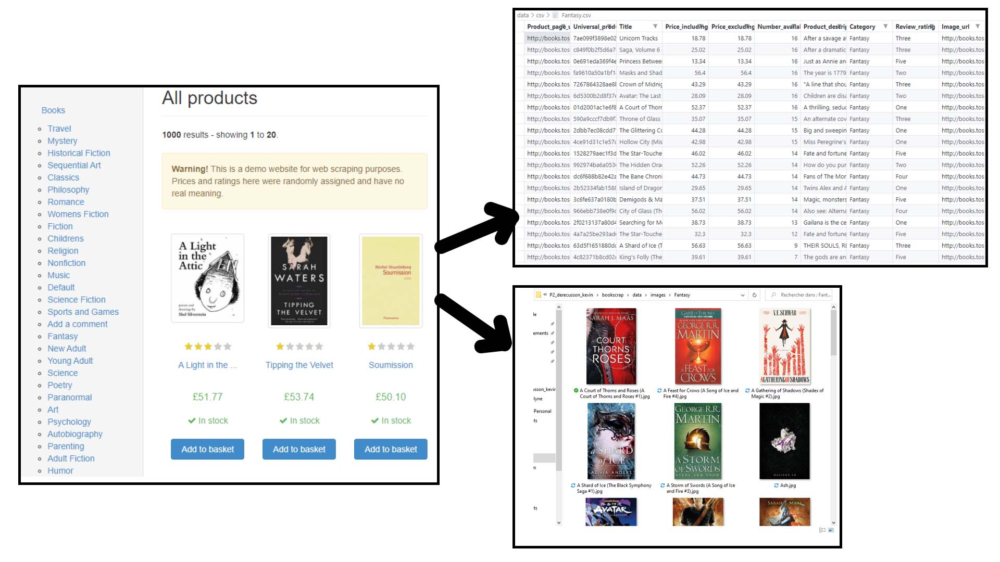

<div id="top"></div>


<!-- PROJECT LOGO -->
<div align="center">
<a href="https://user.oc-static.com/upload/2020/09/22/1600779540759_Online%20bookstore-01.png"></a>

<h3>Web scraping</h3>
<p align="center">
This student project is the #1 of my training and you can follow the next one <a href="https://github.com/KDerec/chesstournamentmanager">here</a>.
</p>
</div>


<!-- TABLE OF CONTENTS -->
<details>
  <summary>Table of Contents</summary>
  <ol>
    <li>
      <a href="#about-the-project">About The Project</a>
    </li>
    <li>
      <a href="#installation">Installation</a>
      <ul>
        <li><a href="#python-installation">Python installation</a></li>
      </ul>
    </li>
    <li><a href="#contact">Contact</a></li>
  </ol>
</details>


<!-- ABOUT THE PROJECT -->
## About The Project
### 🌱 Developped skills
- Configure a <b>Python environnement</b>.<br>
- Apply the basics of <b>Python programming</b>.<br>
- Use <b>Git</b> and <b>GitHub</b> version control systeme.<br>
- Manage data with the <b>ETL (Extract-Transform-Load)</b> process.<br>
- Use of <b>BeautifulSoup</b>, <b>request</b> and <b>csv</b> libraries.<br>
### 🚀 Project goal
Create a program to automate the process of <b>extracting, tranform and load data</b> from the online library <a href="http://books.toscrape.com/">Books to Scrape</a>.<br>
This library is composed of <b>categories</b> and categories are composed of <b>books</b>.<br>
For each categories, a <b>csv file is created</b> at data/csv/<i>category_name</i>.csv <b>with the following informations</b> of each books:
<ul>
<li>product_page_url</li>
<li>universal_ product_code</li>
<li>title</li>
<li>price_including_tax</li>
<li>price_excluding_tax</li>
<li>number_available</li>
<li>product_description</li>
<li>category</li>
<li>review_rating</li>
<li>image_url</li>
</ul>
For each books, the <b>related image is save</b> at data/images/<i>category_name</i>/<i>book_name.jpg</i><br>



<p align="right">(<a href="#top">back to top</a>)</p>


<!-- INSTALLATION -->
## Installation
1. <a href="#python-installation">Install Python</a> ;
2. Clone the project in desired directory ;
   ```sh
   git clone https://github.com/KDerec/bookscrap.git
   ```
3. Change directory to folder ;
   ```sh
   cd path/to/bookscrap
   ```
4. Create a virtual environnement *(More detail to [Creating a virtual environment](https://packaging.python.org/en/latest/guides/installing-using-pip-and-virtual-environments/#creating-a-virtual-environment))* ;
    * For Windows :
      ```sh
      python -m venv env
      ```
    * For Linux :
      ```sh
      python3 -m venv env
      ```
5. Activate the virtual environment ;
    * For Windows :
      ```sh
      .\env\Scripts\activate
      ```
    * For Linux :
      ```sh
      source env/bin/activate
      ```
6. Install package of requirements.txt ;
   ```sh
   pip install -r requirements.txt
   ```

7. Run main.py and enjoy !

### Python installation

1. Install Python. If you are using Linux or macOS, it should be available on your system already. If you are a Windows user, you can get an installer from the Python homepage and follow the instructions to install it:
   - Go to [python.org](https://www.python.org/)
   - Under the Download section, click the link for Python "3.xxx".
   - At the bottom of the page, click the Windows Installer link to download the installer file.
   - When it has downloaded, run it.
   - On the first installer page, make sure you check the "Add Python 3.xxx to PATH" checkbox.
   - Click Install, then click Close when the installation has finished.

2. Open your command prompt (Windows) / terminal (macOS/ Linux). To check if Python is installed, enter the following command (this should return a version number.):
   ``` sh
   python -V
   # If the above fails, try:
   python3 -V
   # Or, if the "py" command is available, try:
   py -V
   ```

<p align="right">(<a href="#top">back to top</a>)</p>


<!-- CONTACT -->
## Contact

Kévin Dérécusson - kevin.derecusson@outlook.fr

Project Link: [https://github.com/KDerec/bookscrap](https://github.com/KDerec/bookscrap)

<p align="right">(<a href="#top">back to top</a>)</p>


<i>This student project is the #1 of my training and you can follow the next one <a href="https://github.com/KDerec/chesstournamentmanager">here</a>.</i>